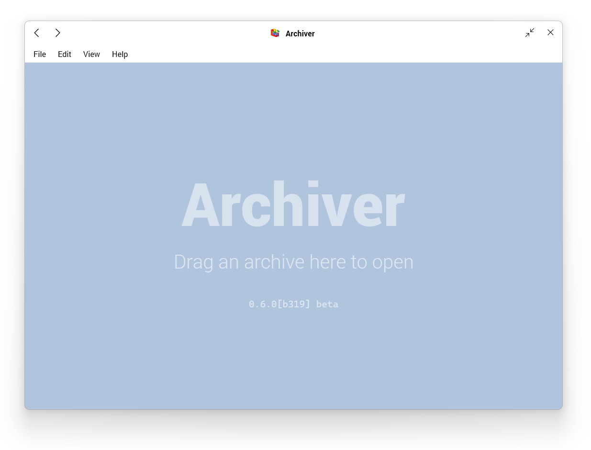
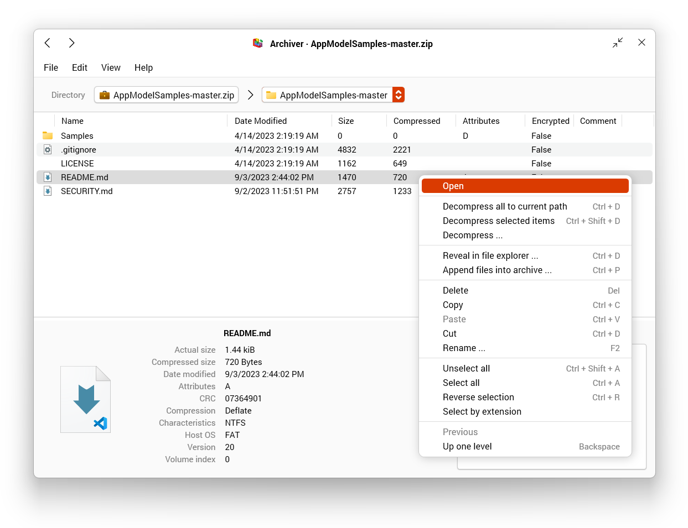
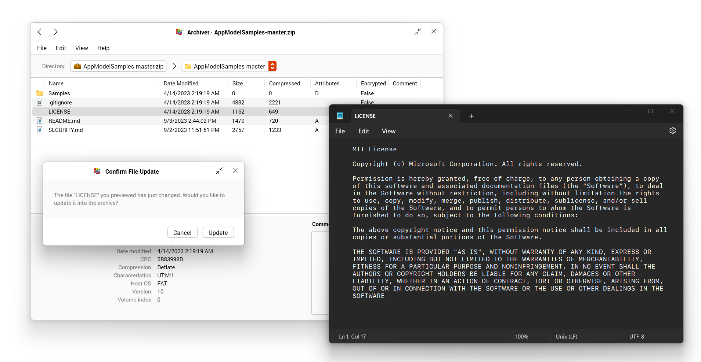
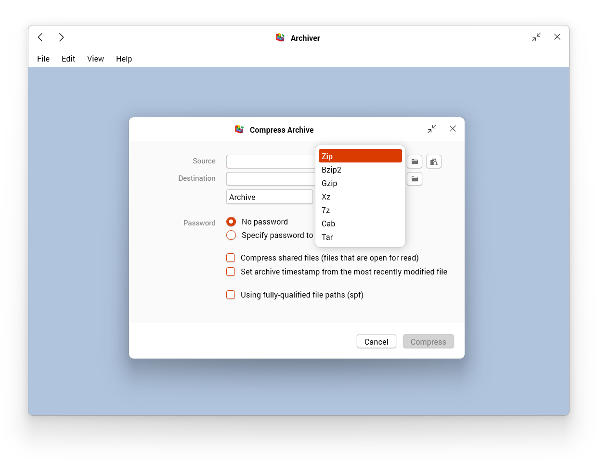

# Archiver

`Archiver` is a graphic user interface wrapper for the command-line utility of 7-zip, aiming to provide full capabilities of 7-zip with a carefully-designed interfaced better than `7zfm`. Written in pure C# language and WPF (.Net Framework 4.7.2).

## User

### Startup

`Archiver` allows you to open files from the `File` menu with history record, drag and drop a file from file explorer, or passed as command-line arguments. 

File archivers are utility programs that require frequent interactions with the system utilities, we also provide a binary setup program to register supported formats (and other Windows shell utilities that will be added later). See releases page for the installer.

### Basic File Operation

Just as any file explorers, we support:
* Paste (`Ctrl + V`), Deletion (`Del`) in archives that are not created with fully qualified file paths.
* Copy (`Ctrl + C`) and rename (`F2`) files.
* View archive contents
* Decompressing all or selected files in the archive.
* Appending new files to the archive
* Editing file contents, and updating the archive once the changes have been saved.

### Compression

Currently, supported compression formats are:

